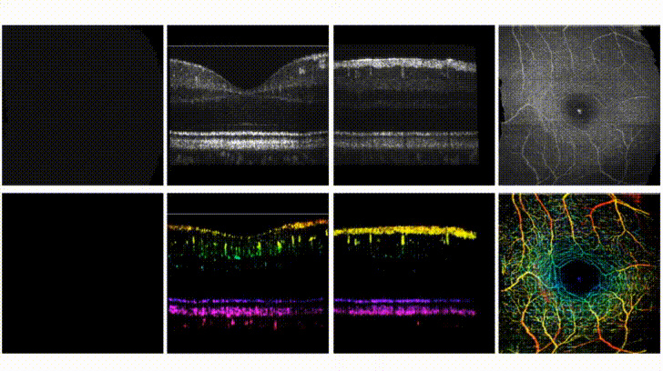

# 🚀 Dave Le

**`Research Scientist`**
---

---

I build AI solutions that bridge research and industry applications. My expertise spans computer vision, natural language processing, and multimodal learning, with a focus on healthcare and life sciences.

I specialize in designing scalable machine learning pipelines, fine-tuning transformer architectures, and integrating imaging, text, and structured data into production-ready models. My work translates advanced AI research into tools that can support clinical decision-making, risk stratification, and automation in real-world settings.

- 👋 Passionate about solving high-impact problems with AI.
- 📧 Reach me at dleninja117@gmail.com.
- 🔭 Current focus: Multimodal survival modeling and AI for medical imaging & clinical text.

---
### ⚙️ GitHub Statistics

### 💻 Languages and Tools

 
 
 
 
 
 

---

## 🌐 Current Interests

- Multimodal AI – integrating imaging, text, and structured data for predictive modeling.
- Healthcare Applications – survival analysis, risk stratification, digital biomarkers.
- Scalable AI Engineering – distributed training, reproducible pipelines, and deployment.

  

