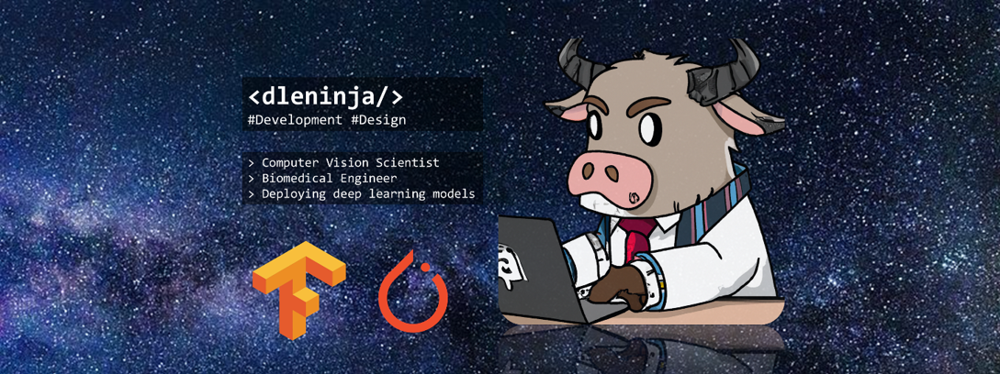

# 🚀 Dave Le

**`Computer Vision Scientist (Researcher/Developer/Enthusiast)`**
---

  

---

I am a research engineer delving into deep neural networks for computer vision in medical imaging. All of my coding projects are developed in coordination with peer-reviewed publications for real-world applications. Currently, I am working on projects related to the classification of retinal diseases and the segmentation of retinal vessels in Optical Coherence Tomography (OCT) and OCT angiography (OCTA).

- 👋 There is an AI revolution on the horizon and I'm happy to be a part of it!
- 📧 If you have any questions, feel free to send an email@ `dleninja117@gmail.com`.
- 🔭 I’m currently working on [MF-AV-Net](https://github.com/dleninja/mf-av-net).

---
### ⚙️ GitHub Statistics

### 💻 Languages and Tools

 
 
 

## Research into OCT and OCTA

OCT and OCTA are advanced imaging techniques that provide fast, non-invasive, real-time, high-resolution, and 3D imaging. They offer numerous digital biomarkers that are useful for various applications. Although retinal imaging is the most common application of OCT and OCTA, they can also be used in other fields such as dermatology and dentistry. With a wealth of valuable data, OCT/OCTA can be readily applied in machine learning and deep learning tasks, including disease classification, image segmentation, and denoising.

  

